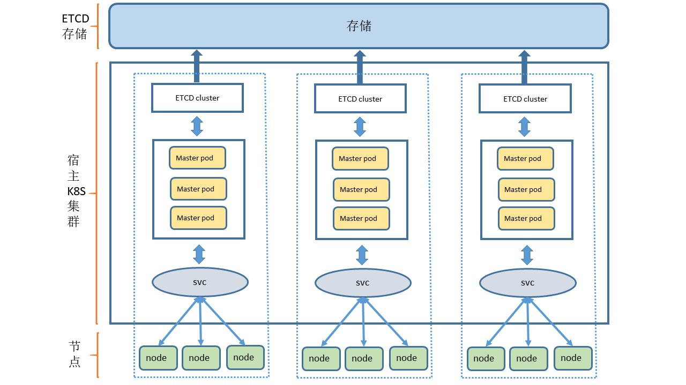

# matrix

将kubernetes集群的master、etcd组件运行在已有的kubernetes集群中

# 架构



# 快速开始

母集群：在使用之前，需要先有一个已运行的kubernetes集群，版本：v1.15.+

### 母集群中创建CRD 

``` shell
kubectl apply -f config/crd.yaml
```

### 创建matrix

``` shell
apiVersion: crd.cxwen.com/v1
kind: Matrix
metadata:
  name: example
```

创建完成之后等待调度, 直到matrix对象ready, 例如下：

```
NAME      K8SVERSION   K8SREPLICAS   ETCDVERSION   ETCDREPLICAS   PHASE   AGE
example   v1.15.12     1             3.3.17        1              Ready   5m13s
```

### 获取集群管理员kubeconfig文件

admin.conf

``` shell
kubectl get master {matrixName}-km -o yaml -n {namespace} | grep adminKubeconfig | awk '{print $2}' | base64 -d > admin.conf
```

使用kubeconfig

``` shell
kubectl get ns --kubeconfig=admin.conf
```

### 加入node


