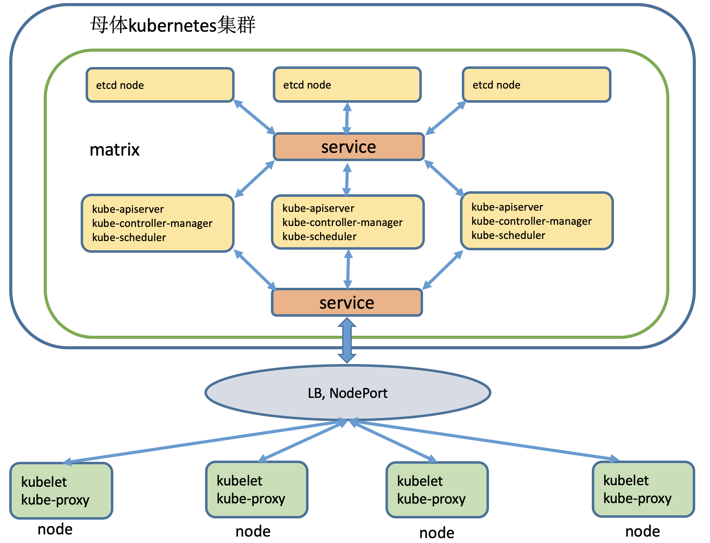

# matrix

将kubernetes集群的master、etcd组件运行在已有的kubernetes集群中，有效节省机器资源，并充分发挥master节点空闲的资源作用

# 特点

- 使用方便：全CRD实现，一个yaml文件搞定部署

- 屏蔽kubernetes底层复杂部署操作，基于已有集群快速建设新集群

- 节省机器资源：多个集群共用同一个母集群，除母集群外，其它集群都不需要再单独使用机器部署master节点 

- 维护简单：只需维护母集群高可用架构，可以充分利用Kubernetes自愈性来实现子集群的高可用
 
# 使用场景

对于需要建设多个k8s集群的需求，可以有效的节省机器资源

例如：

有A、B、C三个项目组分别需要使用：3 master + 3 node 的高可用集群，一共需要18台机器。

采用matrix方案：母集群3台(构建高可用) + A、B、C项目组各3台，一共12台。

# 架构

## 整体架构


## 组件架构



# 快速开始

母体集群：在使用之前，需要先有一个已运行的kubernetes集群，版本：v1.15.*，kubernetes集群部署推荐[sealos一键化部署](https://github.com/fanux/sealos)

### 母体集群中创建CRD 

``` shell
kubectl apply -f config/crd.yaml
```

### 创建matrix

``` shell
apiVersion: crd.cxwen.com/v1
kind: Matrix
metadata:
  name: example
```

创建完成之后等待调度, 直到matrix对象ready, 例如下：

```
NAME      K8SVERSION   K8SREPLICAS   ETCDVERSION   ETCDREPLICAS   PHASE   AGE
example   v1.15.12     1             3.3.17        1              Ready   5m13s
```

### 获取集群管理员kubeconfig文件

admin.conf

``` shell
kubectl get master {matrixName}-km -o yaml -n {namespace} | grep adminKubeconfig | awk '{print $2}' | base64 -d > admin.conf
```

使用kubeconfig

``` shell
kubectl get ns --kubeconfig=admin.conf
```

### 加入node

#### 1、机器基础环境配置

关闭防火墙：

```bash
systemctl stop firewalld
systemctl disable firewalld
```

关闭selinux：
```bash
sed -i 's/enforcing/disabled/' /etc/selinux/config 
setenforce 0
```

关闭swap：

```bash
swapoff -a      # 临时
vim /etc/fstab  #永久（将带有swap的那一行注释掉）
free -m         #查看，swap那一行会全部显示0
```

添加主机名与IP对应关系（记得设置主机名）：
```bash
echo "192.168.1.2 centos01" >> /etc/hosts
```

同步时间：（也可以不用同步，但是三台虚拟机的时间相差不能超过一天，
因为token只有一天的作用效果）

```bash
yum install -y ntpdate
ntpdate ntp1.aliyun.com    #这里用的是阿里的
```

将桥接的IPv4流量传递到iptables的链：
```bash
cat > /etc/sysctl.d/k8s.conf << EOF
net.bridge.bridge-nf-call-ip6tables = 1
net.bridge.bridge-nf-call-iptables = 1
EOF
sysctl --system        #使配置生效
```

#### 2、node节点安装docker

[docker安装](docs/docker.md)

#### 3、node节点安装kubelet和kubeadm

[kubelet及kubeadm安装](docs/kubernetes.md)

#### 4、使用admin.conf生成 kubeadm join 命令，并在node节点上执行

```shell
kubeadm token create --print-join-command --kubeconfig=admin.conf
```
